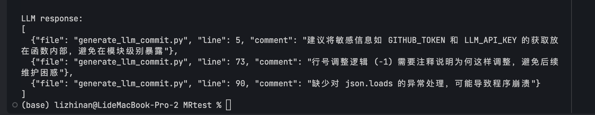

## 基于LLM的MR Reviewer demo 实现

本项目实现了一个基于LLM的MR Reviewer demo

## 基本准备工作(初始化仓库，创建pull request)
1. 在github上创建一个新仓库MRtest， 本地创建一个文件夹MRtest。在本地文件夹目录下执行以下命令:
```bash
git init
git remote add origin add origin URL_ADDRESS.com/yourname/MRtest.git
```
2. 随便写几行代码，创建hello.py文件，将文件提交到仓库main分支。
```bash
git add .
git commit -m "first commit"
git push origin main
```

3. 创建分支mr，将本项目中的generate_llm_commit.py代码提交到分支mr。
```bash
git checkout -b mr
git add.
git commit -m "add generate_llm_commit.py"
git push origin mr
```

4. 回到我们的Github WebUI界面，点击New pull request，选择main分支作为base，mr分支作为compare，点击Create pull request。

## 运行项目
环境安装省略，不需要用到比较复杂的环境。
需要导入相关key:
```bash
export GITHUB_TOKEN=#####################
export LLM_API_KEY=########################
```
直接执行./generate_llm_commit_final.py即可。
其会自动生成三个MR Reviewer的commit。且行号相对准确， 注释也比较合理。 以下是本项目的LLM Response示例：


## 一些改进点
1. LLM的输出不一定能被json解析，比如我们规范了LLM的输出为json格式，但Response可能是以\```json```作为格式进行markdown渲染的，导致json解析失败。 目前是在提示词方面进行进一步约束解决，实际工程肯定是需要对LLM Response进行进一步的解析逻辑上面的处理。

2. 一开始我直接将code_diff信息丢给LLM， 但这样会导致LLM的输出行数和原代码行数不一致。 原因是LLM需要自己统计行号信息，这导致了它最后的输出行号并不准确。  
所以我在提示词中加入了code_diff的行数信息，这样可以保证LLM的输出行数和原代码行数一致。 经过测试，这是一个比较能够明显改进LLM注释行数精准度的做法。以下是示例:

在经过改进前的LLM接受的输入：
```bash
(base) lizhinan@LideMacBook-Pro-2 MRtest % python ./generate_llm_commit.py
all_diffs is 
文件: generate_llm_commit.py
@@ -0,0 +1,95 @@
+import requests
+import os
+
+# 配置
+GITHUB_TOKEN = os.getenv("GITHUB_TOKEN")
+REPO = "Plutoisme/MRtest"
+PR_NUMBER = 2
```

在经过改进后的LLM接受的输入：
```bash
(base) lizhinan@LideMacBook-Pro-2 MRtest % python ./generate_llm_commit.py
all_diffs is 
文件: generate_llm_commit.py
@@ -0,0 +1,95 @@
+[行号:1] import requests
+[行号:2] import os
+[行号:3] 
+[行号:4] # 配置
+[行号:5] GITHUB_TOKEN = os.getenv("GITHUB_TOKEN")
+[行号:6] REPO = "Plutoisme/MRtest"
+[行号:7] PR_NUMBER = 2
+[行号:8] LLM_API_KEY = os.getenv("LLM_API_KEY")
```


